# Button Documentation for Dashboard Pages

## Table of Contents

### 0. [Navigation](#navigation)

- [Notification Button](#navigation-notification-button)(Primary)
- [Logout Button](#navigation-logout-button)(Text)

### 1. [New Dashboard](#newdashboard)

- [Refresh Button](#newdashboard-refresh-button)(Icon)
- [Search Button](#newdashboard-search-button)(Icon)
- [Collapse Button](#newdashboard-collapse-button)(Icon)
- [Load More Button](#newdashboard-load-more-button)(Tertiary)

### 2. [Installation](#installation)

### 3. [On Call](#oncall)

- [Trash Button](#oncall-trash-button)(Secondary)
- [Add New Button](#oncall-add-new-button)(Primary)
- [Status Button](#oncall-status-button)(Tertiary)
- [Customer Name Button](#oncall-customer-name-button)(Link)

### 4. [On Call Create](#oncall-create)

- [Search Button](#oncall-create-search-button)(Primary)

### 5. [On Call Detail](#oncall-detail)

- [Delete Button](#oncall-detail-delete-button)
- [Refund Request](#oncall-detail-refund-request-button)
- [Mark as Complete](#oncall-detail-mark-as-complete-button)

### 6. [On Call Trash](#oncall-trash)

- [Search Button](#oncall-trash-search-button)
- [Status Button](#oncall-trash-status-button)
- [Restore Button](#oncall-trash-restore-button)
- [Delete Permanent Button](#oncall-trash-delete-permanent-button)

### 7. [Customer](#customer)

- [Search Button](#customer-search-button)(Primary)

### 8. [Customer Detail](#customer-detail)

- [Edit Button](#customer-detail-edit-button)(Secondary)
- [Sync Button](#customer-detail-sync-button)(Primary-Icon)
- [Add Button](#customer-detail-add-button)(Primary)
- [Cancel Button](#customer-detail-cancel-button)(Transparent)

### 9. [LSPS](#lsps)

- [Summary Popover Button](#lsps-summary-popover-button)(Icon-Blue)
- [Add New Button](#lsps-add-new-button)(Primary)
- [Detail LSP Button](#lsps-detail-button)(Link)

### 10. [LSPS Create](#lsps-create)

- [Add Button](#lsps-create-add-button)(Primary)
- [Cancel Button](#lsps-create-cancel-button)(Transparent)

### 11. [LSPS Detail](#lsps-detail)

- [Edit Button](#lsps-detail-edit-button)(Secondary)
- [Add LSP Admin](#lsps-detail-add-lsp-admin-button)(Primary)
- [Add Button](#lsps-detail-add-button)(Primary)
- [Cancel Button](#lsps-detail-cancel-button)(Secondary)

### 12. [Inventory](#inventory)

- [Add New Button](#inventory-add-new-button)(Primary)
- [Restock Button](#inventory-restock-button)(Secondary)
- [Reduce Button](#inventory-reduce-button)(Secondary)

### 13. [Plan](#plan)

- [Add New Button](#plan-add-new-button)(Primary)
- [Edit Plan Button](#plan-edit-plan-button)(Secondary)
- [Delete Plan Button](#plan-delete-plan-button)(Danger)

### 14. [Plan Create](#plan-create)

- [Add Button](#plan-create-add-button)(Primary)
- [Cancel Button](#plan-create-cancel-button)(Transparent)

### 15. [Plan Edit](#plan-edit)

- [Save Button](#plan-edit-save-button)(Primary)
- [Cancel Button](#plan-edit-cancel-button)(Transparent)

### 16. [Area Code](#areacode)

- [Add New Button](#areacode-add-new-button)(Primary)
- [Edit Area Code Button](#areacode-edit-areacode-button)(Secondary)
- [Delete Area Code Button](#areacode-delete-areacode-button)(Danger)

### 17. [Area Code Create](#areacode-create)

- [Add Button](#areacode-create-add-button)(Primary)
- [Cancel Button](#areacode-create-cancel-button)(Transparent)

### 18. [Area Code Edit](#areacode-edit)

- [Edit Button](#areacode-edit-edit-button)(Primary)
- [Cancel Button](#areacode-edit-cancel-button)(Secondary)

### 19. [Ports](#ports)

- **OLT**
  - [Add New Button](#ports-olt-add-new-button)(Primary)
  - [Edit OLT Button](#ports-olt-edit-button)(Icon)
- **OLT Create**  
  - [Add Button](#ports-olt-create-add-button)(Primary)
  - [Cancel Button](#ports-olt-create-cancel-button)(Transparent)
- **FDT**
  - [Edit FDT Button](#ports-fdt-edit-button)(Icon)
- **FAT**
  - [Edit FAT Button](#ports-fat-edit-button)(Icon)
  - [Detail FAT Button](#ports-fat-detail-button)(Secondary)
- **FAT Detail**
  - [Refresh Button](#ports-fat-detail-refresh-button)(Icon-Primary)
  - [Customer Account Link](#ports-fat-detail-customer-acc-link)(Link)
  - [PPOE User Link](#ports-fat-detail-ppoe-user-link)(Link)
  - [Verified Button](#ports-fat-detail-verify)(Icon-Blue)

### 20. [Reports](#reports)

- **General**
  - [Export Excel Button](#reports-general-export-excel-button)(Primary)
  - [Customer Detail Button](#reports-general-customer-detail-button)(Link)
  - [Table Row Collapse Button](#reports-general-table-row-collapse-button)(Icon)
- **LSP**
  - [Export Excel Button](#reports-lsp-export-excel-button)(Primary)
- **LSP General**
  - [Export Excel Button](#reports-lsp-general-export-excel-button)(Primary)
- **Inventory**
  - [Export Excel Button](#reports-inventory-export-excel-button)(Primary)
- **On Call**
  - [Export Excel Button](#reports-oncall-export-excel-button)(Primary)
  - [Customer Detail Button](#reports-oncall-customer-detail-button)(Link)

## 0. Navigation 

### **Notification** 

- **Server Action:** fetch the notification related to user logged in.
- **User Interface:** Display popup just under notification icon
- **Type:**: Icon

### **Logout** 

- **Server Action:** Logged the user out,
- **User Interface:** Redirects to <https://sdmstaging.5bb.com.mm/login>
- **Type:** Icon

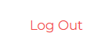

## 1. New Dashboard ([View Page](https://sdmstaging.5bb.com.mm/dashboard/new-dashboard)) 

### **Refresh** 

- **Server Action:** Fetch updated data from the server.
- **User Interface:** Updates the page content.
- **Type:** Text.

### **Search** 

- **Server Action:** Submit the search form.
- **User Interface:** Displays filtered data on the page.
- **Type:** Icon.

### **Collapse** 

- **Server Action:** ---.
- **User Interface:** Minimize or expand a section using JavaScript .
- **Type:** Icon.

### **Load More** 

- **Server Action:** Fetch and append additional data.
- **User Interface:** Dynamically loads more items to the current view.
- **Type:** Tertiary.

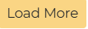

---

## 2. Installation ([View Page](https://sdmstaging.5bb.com.mm/dashboard/installation)) 

---

## 3. On Call ([View Page](https://sdmstaging.5bb.com.mm/dashboard/on-call)) 

### **Trash** 

- **Server Action:** Fetch deleted oncall items.
- **User Interface:** Redirects to <https://sdmstaging.5bb.com.mm/dashboard/on-call-trash>.
- **Type:** Secondary.

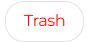

### **Add New** 

- **Server Action:** ---.
- **User Interface:** Redirects to <https://sdmstaging.5bb.com.mm/dashboard/on-call/create>.
- **Type:** Primary.

### Table Buttons

#### **Status** 

- **Server Action:** Fetch details for a specific oncall entry.
- **User Interface:** Redirects to <https://sdmstaging.5bb.com.mm/dashboard/on-call/:oncall_id>.
- **Type:** Tertiary.

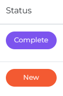

#### **Customer Name** 

- **Server Action:** Fetch details for specific oncall customer.
- **User Interface:** Redirects to <https://sdmstaging.5bb.com.mm/dashboard/customer/:customer_id>.
- **Type:** Link.

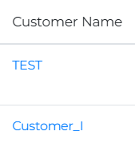

---

## 4. Oncall Create(View Page)([https://](https://sdmstaging.5bb.com.mm/dashboard/on-call/create)) 

### **Search** 

- **Server Action:** ---.
- **User Interface:** ---.
- **Type:** Primary.

---

## 5. OnCall Detail([View Page](https://sdmstaging.5bb.com.mm/dashboard/on-call/322947)) 

### **Delete** 

- **Server Action:** Delete an item from oncall
- **User Interface:** Redirects to oncall page <https://sdmstaging.5bb.com.mm/dashboard/on-call/>
- **Type:** Danger

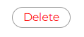

### **Refund Request** <a id="oncall-detail-refund-request-button"></a

- **Server Action:** ---.
- **User Interface** ---.
- **Type:** Primary

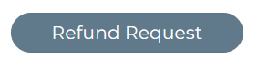

### **Mark as Complete** 

- **Server Action:** ---.
- **User Interface:** ---.
- **Type:** Tertiary.

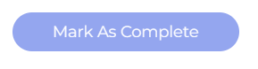

## 6. Oncall Trash([View Page](https://sdmstaging.5bb.com.mm/dashboard/on-call-trash)) <a id="oncall-trash">

### **Search** 

- **Server Action:** ---.
- **User Interface:** ---.
- **Type:** Primary.

### Table Buttons

#### **Status** 

- **Server Action:** ---.
- **User Interface:** ---.
- **Type:** Tertiary.

#### **Restore** 

- **Server Action:** ---.
- **User Interface:** ---.
- **Type:** Primary

#### **Delete Permanent** 

- **Server Action:** ---.
- **User Interface:** ---.
- **Type:** Danger

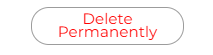

---

## 7. Customer ([View Page](https://sdmstaging.5bb.com.mm/dashboard/customer)) 

### **Search** 

- **Server Action:** Submit the search form.
- **User Interface:** Displays filtered data on the page.
- **Type:** Primary.

---

## 8. Customer Detail([View Page](https://sdmstaging.5bb.com.mm/dashboard/customer/139621))   

### **Edit Button:** 

- **Server Action:** ---.
- **User Interface:** Make all the fields editable. Show save and cancel button.
- **Type:** ---.

### **Sync Button** 

- **Server Action:** ---.
- **User Interface:** ---.
- **Type:** Primary

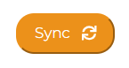

### **Save** 

- **Server Action:** ---.
- **User Interface:** Cancel the editable state. Submit updated data to server.
- **Type:** Primary

### **Cancel** 

- **Server Action:** ---.
- **User Interface:** Cancel the editable state.
- **Type:** Transparent.

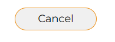

---

## 9. LSPS ([View Page](https://sdmstaging.5bb.com.mm/dashboard/lsps)) 

### **Summary Popover** 

- **Server Action:** Fetch the summary info of all lsps.
- **User Interface:** Display popup just beside ? icon
- **Type:** Icon

### **Add New** 

- **Server Action:** ---.
- **User Interface:** Redirects to <https://sdmstaging.5bb.com.mm/dashboard/lsp/create>.
- **Type:** Primary.

### Table Buttons

#### **LSP Detail** 

- **Server Action:** ---.
- **User Interface:** Redirects to <https://sdmstaging.5bb.com.mm/dashboard/lsp/:lsp_id?name=installation>.
- **Type:** Link.

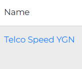

---

## 10. LSPS Create ([View Page](https://sdmstaging.5bb.com.mm/dashboard/lsp/create)) 

### **Add** 

- **Server Action:** ---.
- **User Interface:** ---.
- **Type:** Primary

### **Cancel** 

- **Server Action:** ---.
- **User Interface:** ---.
- **Type:** Transparent.

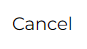

---

## 11. LSPS Detail ([View Page](https://sdmstaging.5bb.com.mm/dashboard/lsp/5?)) 

### **Edit Button:** 

- **Server Action:** ---.
- **User Interface:** Make all the fields editable. Show save and cancel button.
- **Type:** ---.

### **ADD LSP to Admin** 

- **Server Action:** ---.
- **User Interface:** ---.
- **Type:** Primary.

### **Save** 

- **Server Action:** ---.
- **User Interface:** Cancel the editable state. Submit updated data to server.
- **Type:** Primary

### **Cancel** 

- **Server Action:** ---.
- **User Interface:** Cancel the editable state.
- **Type:** Transparent.

---

## 12. Inventory ([View Page](https://sdmstaging.5bb.com.mm/dashboard/inventory)) 

### **Add New** 

- **Server Action:** ---.
- **User Interface:** Displays a modal for adding new inventory.
- **Type:** Primary.

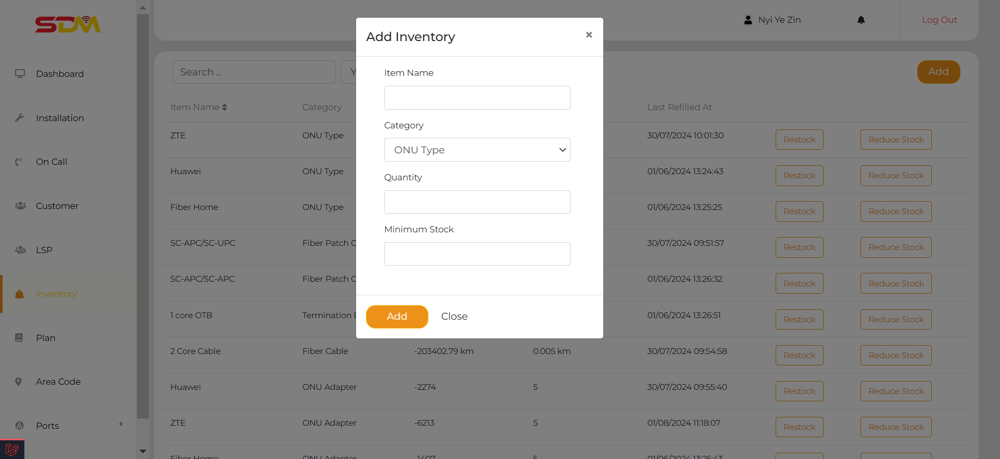

### Table Buttons

#### **Restock** 

- **Server Action:** ---.
- **User Interface:** Displays a restock modal for a specific inventory item.
- **Type:** Secondary.

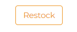
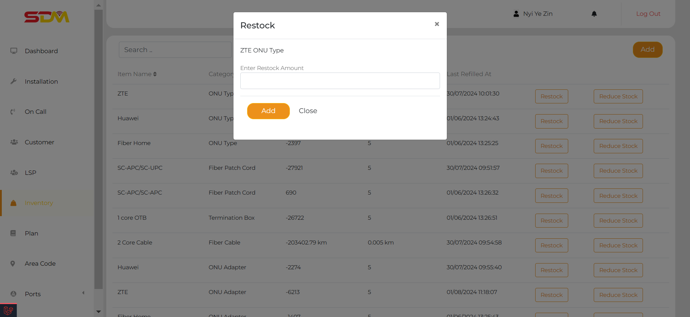

#### **Reduce** 

- **Server Action:** ---.
- **User Interface:** Displays a reduce stock modal for a specific inventory item.
- **Type:** Secondary.

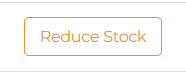
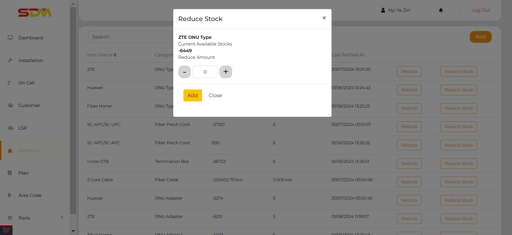

---

## 13. Plan ([View Page](https://sdmstaging.5bb.com.mm/dashboard/plan)) 

### **Add New** 

- **Server Action:** ---.
- **User Interface:** Redirects to the page: `https://sdmstaging.5bb.com.mm/dashboard/plan/create`.
- **Type:** Primary.

### Table Buttons

#### **Edit Plan** 

- **Server Action:** Fetch details for specific plan entry.
- **User Interface:** Redirects to the page: `https://sdmstaging.5bb.com.mm/dashboard/plan/:plan_id/edit`.
- **Type:** Secondary.

#### **Delete Plan** 

- **Server Action:** Delete an item from inventory.
- **User Interface:** If related transactions exist, show an alert saying `Can't delete this request. Related transactions exist.` else remove from view.
- **Type:** Danger.

---

## 14. Plan Create ([View Page](https://sdmstaging.5bb.com.mm/dashboard/plan/create)) 

### **Add** 

- **Server Action:** ---.
- **User Interface:** ---.
- **Type:** Primary.  

### **Cancel** 

- **Server Action:** ---.
- **User Interface:** Redirects to <https://sdmstaging.5bb.com.mm/dashboard/plan>.
- **Type:** Transparent.

---

## 15. Plan Edit ([View Page](https://sdmstaging.5bb.com.mm/dashboard/plan/1/edit)) 

### **Save** 

- **Server Action:** Submit the updated data to server.
- **User Interface:** If successful, show the toast message and redirects to <https://sdmstaging.5bb.com.mm/dashboard/plan> page.
- **Type:** Primary.

### **Cancel** 

- **Server Action:** ---.
- **User Interface:** Redirects to <https://sdmstaging.5bb.com.mm/dashboard/plan>.
- **Type:** Transparent.

---

## 16. Area Code ([View Page](https://sdmstaging.5bb.com.mm/dashboard/area-code)) 

### **Add New** 

- **Server Action:** ---.
- **User Interface:** Redirects to the page: `https://sdmstaging.5bb.com.mm/dashboard/area-code/create`.
- **Type:** Primary.

### Table Buttons

#### **Edit Area Code** 

- **Server Action:** Fetch detais for specific areacode entry.
- **User Interface:** Redirects to the page: `https://sdmstaging.5bb.com.mm/dashboard/area-code/:areacode_id/edit`.
- **Type:** Secondary.

#### **Delete Area Code** 

- **Server Action:** Delete an item from areacode.
- **User Interface:** If related transactions exist, show an alert saying `Can't delete this request. Related transactions exist.` else remove from view.
- **Type:** Danger.

---

## 17. Area Code Create ([View Page](https://sdmstaging.5bb.com.mm/dashboard/area-code/create)) 

### **Add** 

- **Server Action:** Create the new area code with submitted data.
- **User Interface:** Redirects to <https://sdmstaging.5bb.com.mm/dashboard/area-code/>.
- **Type:** Primary.

### **Cancel** <a id="areacode-create-cancel-button"></a

- **Server Action:** ---.
- **User Interface:** Redirects to <https://sdmstaging.5bb.com.mm/dashboard/area-code/>.
- **Type:** Transparent.

---

## 18. Area Code Edit ([Viea Page](https://sdmstaging.5bb.com.mm/dashboard/area-code/1/edit)) 

### **Edit** 

- **Server Action:** Update the specfic areacode with updated data.
- **User Interface:** If successful, show toast at the top and redirects to <https://sdmstaging.5bb.com.mm/dashboard/area-code/>.
- **Type:** Primary.

### **Cancel** 

- **Server Action:** ---.
- **User Interface:** Redirects to <https://sdmstaging.5bb.com.mm/dashboard/area-code/>
- **Type:** Transparent.

---

## 19. Ports 

### OLT 

#### **Add New** 

- **Server Action:** ---.
- **User Interface:** Redirects to the page: `https://sdmstaging.5bb.com.mm/dashboard/olt/create`.
- **Type:** Primary.

#### Table Buttons

##### **Edit OLT** 

- **Server Action:** Fetch details for specific OLT port entry.
- **User Interface:** Opens a modal to edit a specific OLT port.
- **Type:** Icon.

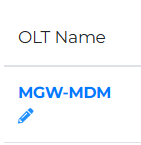
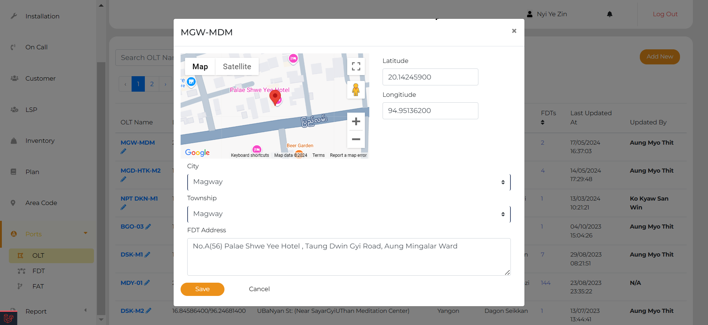

### OLT Create 

#### **Add** 

- **Server Action:** Create a new olt entry with submitted data.
- **User Interface:** If successful, redirects to <https://sdmstaging.5bb.com.mm/dashboard/olt/>.
- **Type:** Primary.

#### **Cancel** 

- **Server Action:** ---.
- **User Interface:** redirects to <https://sdmstaging.5bb.com.mm/dashboard/olt/>.
- **Type:** Transparent.

---

### FDT 

#### Table Buttons

##### **Edit FDT** 

- **Server Action:** Fetch details for specific FDT port entry.
- **User Interface:** Opens a modal to edit a specific FDT port.
- **Type:** Icon.

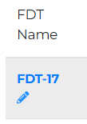
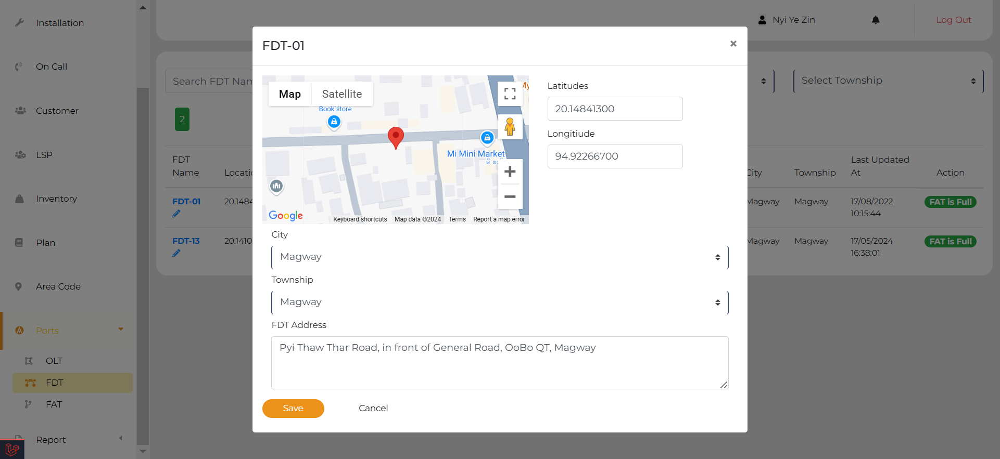

---

### FAT 

#### Table Buttons

##### **Edit FAT** 

- **Server Action:** Fetch details for specific FAT port entry.
- **User Interface:** Opens a modal to edit a specific FAT port.
- **Type:** Icon.

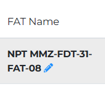
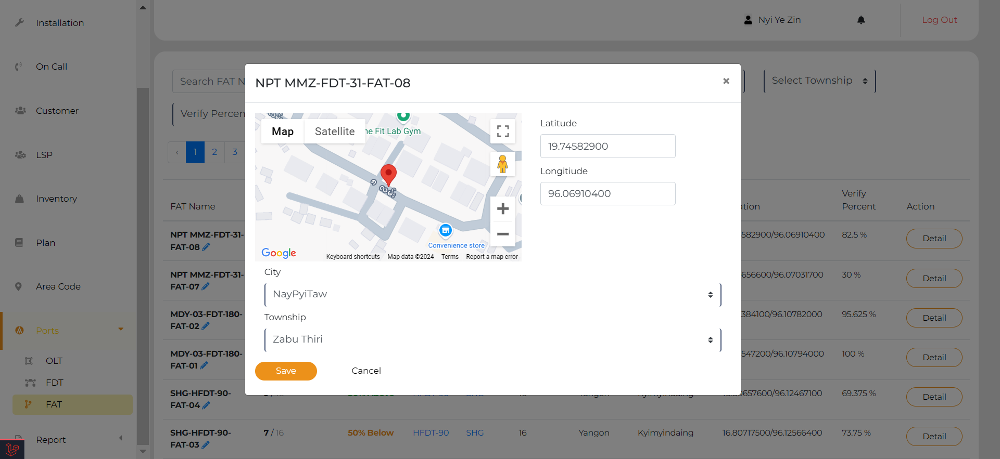

##### **Detail FAT** 

- **Server Action:** Fetch details for specific FAT port entry.
- **User Interface:** Redirects to the page: `https://sdmstaging.5bb.com.mm/dashboard/fat/24880`.
- **Type:** Secondary.

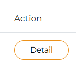

### FAT Detail 

#### **Refresh** 

- **Server Action:** ---.
- **User Interface:** ---.
- **Type:** Primary.

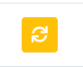

#### Table Buttons

##### **Customer Account Link** 

- **Server Action:** ---.
- **User Interface:** ---.
- **Type:** Link.

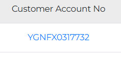

#### **PPOE User Link** 

- **Server Action:** ---.
- **User Interface:** ---.
- **Type:** Link.

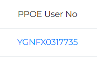

#### **Verified** 

- **Server Action:** ---.
- **User Interface:** More info about specific portal verified status is shown.
- **Type:** Icon.

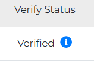

---

## 20. Reports 

### General 

#### **Export to Excel** 

- **Server Action:** Exports an .xlsx file containing all general reports.
- **User Interface:** ---.
- **Type:** Primary.

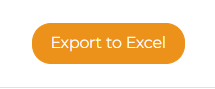

#### Table Buttons

##### **General Report Customer Detail** 

- **Server Action:** Fetch details of customer belonging to specific general report entry.
- **User Interface:** Redirects to the page: `https://sdmstaging.5bb.com.mm/dashboard/customer/:customer_id`.
- **Type:** Link.

##### **Table Row Collapse Button** 

- **Server Action:** ---.
- **User Interface:** Collapses or un-collapses the table row.
- **Type:** Icon.

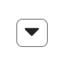

---

### LSP 

#### **Export to Excel** 

- **Server Action:** Exports an .xlsx file containing all LSP reports.
- **User Interface:** ---.
- **Type:** Primary.

---

### LSP General 

#### **Export to Excel** 

- **Server Action:** Exports an .xlsx file containing all LSP general reports.
- **User Interface:** ---.
- **Type:** Primary.

---

### Inventory 

#### **Export to Excel** 

- **Server Action:** Exports an .xlsx file containing all inventory reports.
- **User Interface:** ---.
- **Type:** Primary.

---

### On Call 

#### **Export to Excel** 

- **Server Action:** Exports an .xlsx file containing all oncall reports.
- **User Interface:** ---.
- **Type:** Primary.

#### Table Buttons

##### **On Call Customer Detail** 

- **Server Action:** Fetch the details of customer belonging to specific oncall entry.
- **User Interface:** Redirects to the page: `https://sdmstaging.5bb.com.mm/dashboard/customer/:customer_id`.
- **Type:** Link.

---

### Notes 

1. **Labels:**
   - **Server Action:** Describes the action performed by the server when the button is clicked.
   - **User Interface:** Describes the changes visible to the user on the page.
   - **Type:** Specifies the button type.
